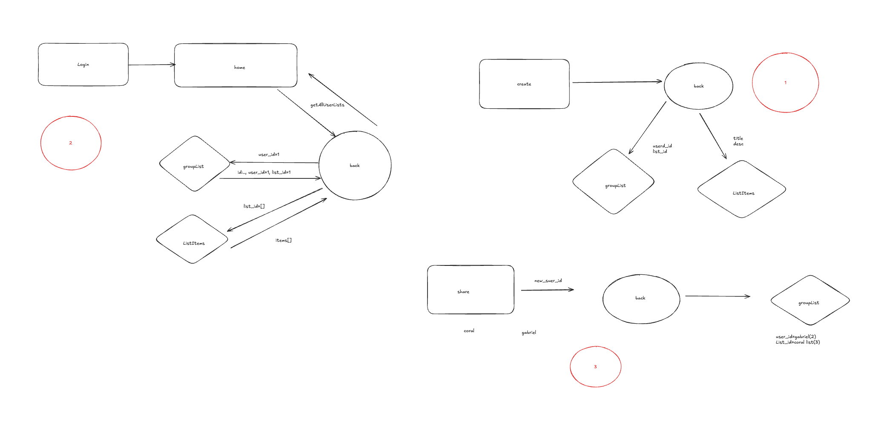

כן, הפתרון הזה משלב את שני העקרונות: המלצות חכמות ו-ניהול רשימות חכמות.


### **Welcome to Application LISTA - Backend** 👋  

# **Lista - Personal and Collaborative List Management App**  

The backend of **Lista**, a personal and collaborative list management app, is built to deliver seamless, secure, and efficient functionalities. Below is the detailed README for setting up and contributing to this project.

---

## **📋 Overview**  
**Lista** is your ultimate solution for organizing and managing personal and shared lists. It combines real-time updates, customization options, and a user-friendly experience.


---

## **To Do List:**  

- **Environment Setup - ENV :** Done  

---

## **Database:**  
- `data.json`: ??????  

---
## **Table of Contents**  
1. [Introduction](#introduction)  
2. [Project Goals](#project-goals)  
3. [Target Audience](#target-audience)  
4. [Technologies Used](#technologies-used)  
5. [Key Features](#key-features)  
6. [Screens](#screens)  
7. [Database Models](#database-models)  
8. [API Endpoints](#api-endpoints)  
9. [Installation and Setup](#installation-and-setup)  
10. [Code Quality and Logging](#code-quality-and-logging)  
11. [Development Process](#development-process)  
12. [CRUD Status](#crud-status)
13. [High Level Design](##high-level-design")  
14. [Future Plans](#future-plans)  
15. [Contributing](#contributing)  

---

## **Introduction**  
The idea for **Lista** arose from a daily need to organize, manage, and track 
lists and tasks effortlessly.  
**Lista** provides an all-in-one solution that combines personal and collaborative 
list management with real-time updates and customizable design.
The backend is developed using **Django REST Framework**, ensuring robustness and 
scalability. It supports secure user 
authentication, list sharing, and real-time collaboration.

---

## **Project Goals**  
- Create an intuitive application for managing lists, compatible with all devices 
(mobile and desktop).  
- Enable real-time collaboration, editing, and sharing of lists.  
- Provide user-friendly tools for productive and seamless management.  
- Deliver a highly personalized user experience.  

---

## **Target Audience**  
- **Individuals**: People looking to organize personal lists and tasks.  
- **Groups**: Teams managing projects, events, or activities collaboratively.  
- **Organized Users**: People who need to share and manage information efficiently 
with tailored permissions.  

---

## **Technologies Used**  

| Domain       | Technology               |
|--------------|--------------------------|
| Frontend     | React Native TSX, Expo   |
| Backend      | Django REST Framework, CORS |
| Database     | SQLite                   |
| Security     | JWT Authentication       |
| Logging      | Python Logging Library   |
| Code Quality | Pylint Static Analysis   |

---

- **Frontend**: React Native with TypeScript, powered by **Expo** for streamlined project management and development.  
- **Backend**: Django REST Framework, with CORS support to ensure smooth cross-origin communication.  
- **Database**: SQLite for lightweight and efficient data storage.  
- **Security**: Authentication and permission management using **JWT (JSON Web Tokens)**.  
- **Communication**: **Axios** facilitates seamless HTTP requests between the frontend and backend.  
- **Code Quality**: Static analysis performed with **Pylint** to maintain clean, error-free code.  
- **Logging**: Robust debugging and auditing capabilities via **Python's logging module**.  

---

## **Key Features**  
1. **List Management**  
   - Create and manage lists by category (e.g., shopping, tasks, travel).  
   - Add tasks with notes, images, and deadlines.  
   - Mark tasks as complete.  

2. **List Sharing**  
   - Share lists with others via email.  
   - Choose user permissions:  
     - **Read-Only**  
     - **Full Edit Access**  

3. **Real-Time Updates**  
   - Changes reflect immediately for all users connected to a shared list.  

4. **Customization**  
   - Design lists with personalized backgrounds.  

5. **User-Friendly Interface**  
   - Clean, intuitive design suitable for all user types.  

6. **Security and User Management**  
   - Secure registration and login with **JWT**.  
   - Permission-based management by user and list.  

---

## **Screens**  

1. **Sign Up and Login**  
   - Registration with username, full name, email address, and password.
   - Login for existing users with username and password.  

2. **List Overview**  
   - View all lists (personal and shared).  
   - Create and manage new lists.  

3. **List Creation**  
   - Select categories, add tasks, deadlines, and images.  

4. **Edit and Share Lists**  
   - Modify list details and tasks.  
   - Share lists with additional users and set permissions.  

5. **Notifications**  
   - Track changes and updates to shared lists.  

---

## **Database Models**  

### **Users**  
Utilizes Django’s built-in `User` model:  
- **User ID**: Unique identifier.  
- **Username**: Unique within the system, used for login alongside the password
- **First Name**: User's given name. 
- **Last Name:**: User's family name 
- **Email**: Used for sharing lists and password recovery.  
- **Password**: Secure authentication credential.  

### **ListItem**  
Represents tasks or list items:  
- **List ID**: Unique identifier for the list.  
- **Title**: Default: `"No items"`.  
- **Items**: Stored as plain text.  
- **Creation Date**: Auto-generated upon list creation.  
- **Owner**: Associated with the user who created it.  
- **Status**: Active or inactive.  

### **GroupList**  
Manages collaborative list sharing:  
- **User**: Reference to a participating user.  
- **List**: Reference to the shared list.  
- **Join Date**: Date user joined the group.  
- **Role**: Either `Admin` or `Member`.  
- **Permissions**: `Read-Only` or `Full Access`.  

### **ListItemImage**  
Stores images associated with a specific list item and index:
- **List Item:**: A foreign key linking to the ListItem model (on_delete=models.CASCADE, related_name='images').
- **Image:**: An image file, optional (default='/placeholder.png', upload_to='list_item_images/').
- **Index:**: Position of the image in the list, defaults to 0.
- **MIME Type:**: Optional field to store the image's MIME type (max_length=50).

### **Customization**  
Allows users to personalize their experience:  
- **User**: Reference to the modifying user.  
- **Background**: Identifier for a custom background image.  

### **Recommendation**  
Stores recommendations related to specific list items:
- **List Item**: A foreign key linking to the ListItem model (on_delete=models.CASCADE, 
related_name="recommendations").  
- **Recommended Items**: A text field containing recommended items, separated by commas.
- **Created At**: Automatically records the timestamp when the recommendation is created.
python


---

## **Development Process**  
1. **Planning and Design**  
   - Market research, wireframes, and user interface design.  

2. **Frontend Development**  
   - Built with React Native and Expo.  

3. **Backend Development**  
   - Developed using Django for API, authentication, and security.  

4. **Integration**  
   - Seamless data exchange using Axios.  

5. **Quality Assurance (QA)**  
   - Manual and automated feature testing.  

6. **Release and Feedback**  
   - Initial launch followed by user feedback for continuous improvement.  

---

## **🚀Installation and Setup**  
Follow these steps to install and run the application locally:  

1. Clone the repository:  
   ```bash
   git clone https://github.com/username/lista.git
   cd lista
   ```
2. Install dependencies:  
   ```bash
   pip install -r requirements.txt
   cd frontend
   npm install
   expo start or npm run web

   ```
3. Start the server:  
   ```bash
   python manage.py runserver
   npm start
   ```
---

💻

    
  
  

---

## **Features**  
1. **User Authentication**  
   - Secure signup and login using JWT.  
   - Permissions for list sharing and collaboration.

2. **CRUD Operations**  
   - Create, read, update, and delete for users and list management.  

3. **Real-Time Collaboration**  
   - Changes are reflected instantly for shared lists.  

4. **Logging**  
   - Detailed logs for debugging and monitoring using the Python logging library.  

5. **Code Quality**  
   - Code analyzed and improved using **Pylint**.  

---

## **CRUD Status**  

| Feature            | Status       | Notes                   |
|--------------------|--------------|-------------------------|
| **Users**          | ✅ Completed | Full CRUD functionality |
| **ListItem**       | ✅ Completed | Full CRUD functionality |
| **ListItemImage**  | ✅ Completed | Full CRUD functionality |
| **GroupList**      | ✅ Completed | Full CRUD functionality |
| **Customization**  | ✅ Completed | Full CRUD functionality |
| **Recommendation** | ✅ Completed | Full CRUD functionality |


---

### CRUD Operations  

#### Customers  
| Action  | URL                  | Method | Body (Example)                                                                                     |
|---------|----------------------|--------|---------------------------------------------------------------------------------------------------|
| Create  | `/api/customers/`    | POST   | `{ "name": "John", "email": "john@example.com", "phone": "123456789" }`                           |
| Read    | `/api/customers/`    | GET    | None                                                                                              |
| Read by ID | `/api/customers/<id>/` | GET    | None                                                                                              |
| Update  | `/api/customers/<id>/` | PUT    | `{ "name": "John Updated", "phone": "987654321" }`                                                |
| Delete  | `/api/customers/<id>/` | DELETE | None                                                                                              |

---

## **API Endpoints**  
### Get All Lists  
- **URL:** `/api/listitem/`  
- **Method:** `GET`  
- **Response:**  
  ```json
  [
    {
      "id": 1,
      "title": "Shopping List",
      "items": ["Milk", "Bread"],
      "user_id": 2,

    }
  ]
  ```  

  ### Get Lists by user 
- **URL:** `/api/listitem/by-user/{user_id}`  
- **Method:** `GET`  
- **Response:**  
  ```json
  [
    {
      "id": 1,
      "title": "Shopping List",
      "items": ["Milk", "Bread"],
    }
  ]
  ```  

### User Authentication  
#### Register  
- **URL:** `/api/register/`  
- **Method:** `POST`  
- **Body Example:**  
  ```json
  {
    "username": "user1",
    "first_name": "John",
    "last_name": "Doe", 
    "email": "user1@example.com",
    "password": "password123"
  }
  ```

#### Login  
- **URL:** `/api/login/`  
- **Method:** `POST`  
- **Body Example:**  
  ```json
  {
    "username": "user1",
    "password": "password123"
  }
  ```

---

## **High Level Design**  



---

### Backend Setup (Django)  

# Begin:

1. **Clone the repository:**  
   ```bash
   git clone https://github.com/username/lista-backend.git
   cd lista-backend
   ```

2. **Create a virtual environment:**  
   - macOS/Linux:  
     ```bash
     python3 -m venv env
     source env/bin/activate
     ```  
   - Windows:  
     ```bash
     python -m venv env
     env\Scripts\activate
     ```

3. **Install dependencies:**  
   ```bash
   pip install -r requirements.txt
   python manage.py runserver

   ```

4. **Run migrations:**  
   ```bash
   python manage.py makemigrations
   python manage.py migrate
   ```

5. **Start the server:**  
   ```bash
   python manage.py runserver
   ```

-----------


1. Activate the virtual environment:
   - Create a virtual environment: For macOS: `python3 -m virtualenv env` after, Activate the virtual 
   environment: `source env/bin/activate`
   - For other systems: `python -m virtualenv env` after Activate the virtual environment: 
   `env\Scripts\activate`

   Once activated, you’ll notice the terminal prompt changes to include the environment name (e.g., (env) at 
   the start of the line).To deactivate the virtual environment, use the command: `deactivate`

2. Install the requirements:
   - For macOS: `pip3 install -r requirements.txt`
   - For other systems: `pip install -r requirements.txt`

3. Run the program:
   - For macOS: `python3 manage.py runserver`
   - For other systems: `python manage.py runserver`

4. Run migrations:
   - For macOS: `python3 manage.py makemigrations` & `python3 manage.py migrate`
   - For other systems: `python manage.py makemigrations` & `python manage.py migrate`


5. You can delete the data in the database file and write your own data from scratch. It will work.

---

## **Code Quality and Logging**  

- **Pylint Analysis:**  
  Code is checked with Pylint to ensure clean and readable syntax.  
  Run the following command to analyze the code:  
  ```bash
  pylint <file_name>.py
  ```

- **Logging:**  
  Logs are stored and monitored for debugging and performance analysis.  
  Example log entry (INFO level):  
  ```json
  {
    "timestamp": "2024-11-19T12:34:56",
    "level": "INFO",
    "message": "New user registered: user1"
  }
  ```

---

## **Future Upgrades**  
- Integration with external apps.  
- Performance analytics and productivity tracking.  
- Personalized notifications powered by AI.  

---

### **🤝 Contributing** 
Contributions are welcome!  
1. Fork the repository.  
2. Create a feature branch: `git checkout -b feature-name`.  
3. Commit your changes: `git commit -m 'Add feature'`.  
4. Push to the branch: `git push origin feature-name`.  
5. Open a pull request.  

---


1. **Fork the repository** to your GitHub account.  
2. **Clone your fork**:  
   ```bash
   git clone https://github.com/yourusername/lista-backend.git
   ```  
3. Create a new branch:  
   ```bash
   git checkout -b feature/your-feature-name
   ```  
4. Commit changes:  
   ```bash
   git commit -m "Add your feature"
   ```  
5. Push changes:  
   ```bash
   git push origin feature/your-feature-name
   ```  
6. Open a **pull request** in the original repository.  

---

**Thank you for exploring Lista and its backend! We’re excited 
to see how you use 
and improve it. 😊.** 

**We’re here to make your life easier and more organized.** 😊  


    For improvements, suggestions, and constructive feedback,
     I am always happy to hear from you. Enjoy and good luck!
---

### **Contact Us**
For technical issues or inquiries, please contact:  
📧 **listaassistance@gmail.com**  
